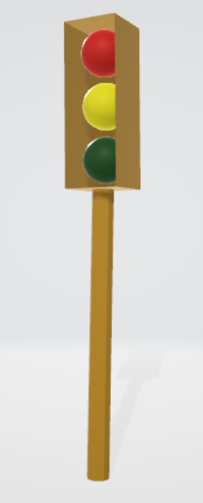
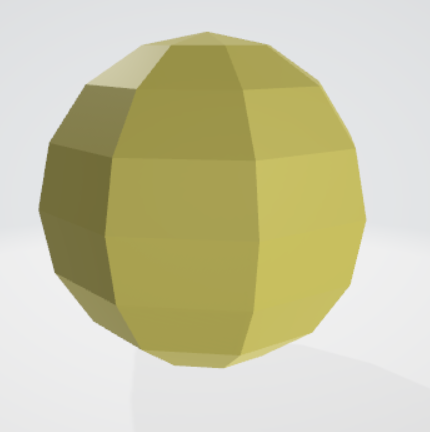
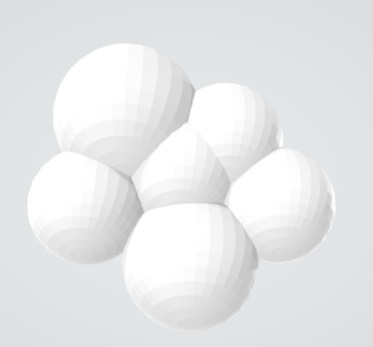
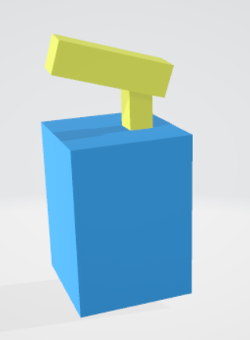
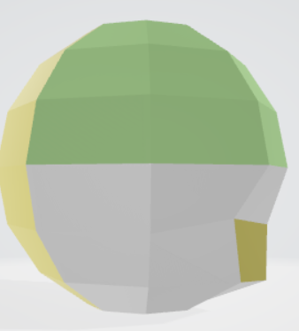

# 4331 Virtual Reality Project 1 in A-Frame

This project mainly focuses on the human experience from 'inside out' vr. My project has many 3D gltf models (downloaded from othersites), some 3D models (created by me), dynamic objects to interact with, some objects having animation, controlled lighting for day/night simulation, audio sounds which give the feel of being present in the environment. The loading time of the project webpage is 4.98 seconds.

# Useful Links

 Video Link https://youtu.be/k3M9TvJjrFA

 Demo Link https://vaishnaveesharma.github.io/VR-Project1/

 Github Link https://github.com/VaishnaveeSharma/VR-Project1

# Motivation/ Idea

Covid-19 has affected all of us in some way or the other. Many of us bored of sitting at home we miss going out. Also when we go out for urgent work we have to carry mask and sanitizer with us for safety purposes. Despite causing a lot of troubles for humans Covid-19 proved to be good for the 'nature'. The air pollution, water polltion has reduced considerably, birds and animals are becoming more flourished even in the cities. 
So my idea was to highlight the good effects of corona virus in my project like the ones I have mentioned above. To make the difference visible easily i hav ecreated two environments which shows the before and after covid-19 simulation of a city.

# Instructions for Interaction

Once the environment is loaded completely than the user can see a virtual simulation of a city area, by default it is in 'before covid-19' mode and it shows th e'afternoon time' of the day. There is a board having the buttons for the user to interact with the objects the environment using the cursor which can be controlled by the mouse or the touch pad of the laptop, or simply by moving the head while using the google cardboard. 

There are click events in the environment where the user has the capabiliyty to interact with the objects by clicking on them. To make it easy for first time user there is a text message displayed on top of every place where interaction is possible. In total there are five objects with which the user can interact. They are described below.

# Interactions

There are different types of interactions in the envrioment. For easy interaction between the user and the interactive objects theer is a text message displayed so that the user can understand and interact with the objects properly and easily.

## Covid-19 Mode

To switch between the 'after' and 'before' covid1-9 enviromnent there is abutton which the user can click in order to cheng the environmenyt according to his choice.

## Bird Chirping Sound

In the Covid-19 mode there is an extra interaction between the user and the sparrow in the environment. When clicke near the sparrow it will start chirping as a real sparrow.

## Day/ Night Mode 

This let the user switch between the day and night view of the city. 

## City Noise Imitation

There i sa button when clicked by the user imitates the sound/ noise of the city.

## Building Light  

The user has the access to switch 'on or off' the light attached to the center building.

# Self-created models 

For creating the models, i have used the blender software. I have created 6 models in blender from scratch. They are as follows:-

## Traffic Light

There two of these traffic lights in the environment. one is on the left and the other is on the right of the environment.

## FootBall

Two kids playing with the football can be seen on the greemn grass garden on the right side of the camera.

## Cloud

This can be seen on the left side of the environment. Besides the skyscapper building.

## Red Color Mask

This can be seen on the face of the person standing on the grass garden on the right.

## Sanitizer

The person standing on the grass garden is holding this sanitizer bottle in his hand.

## Stones/ Pebbles

These stones can be seen on the green grass garden on the right side of the environment.

# Issues

It was a challenging project. But at the same time it was fun and learning to work on it. While working on the project there were many issues which i have faced. Some of them are:-

## Smooth cursor movement

Nausea is a very common feeling while experiencing VR. It took me a lot of research to make the cursor movement as smooth as possible for the user so that the problem of nausea is minimised. For this i first used teleporting but the results with teleporting were not appreciable. so then i looked for other ways and finaly found 'movement-controls' which gave me good results. 'user-controls' has been replaced by 'movement-controls' in aframe. Below link gives more detailed about the usage of movement-controls.

https://github.com/n5ro/aframe-extras/pull/217

## Creating 3D models in Blender

I just loved craeting the model in blender now. But initially it took me a very long time to get my hands work on blender. I have watched a number a videos for that on youtube some of them are:-

https://www.youtube.com/watch?v=ICBP-7x7Chc&t=375s

https://www.youtube.com/watch?v=MF1qEhBSfq4

# Conclusion

This project worked as an icebreaker for me into the world of VR. I now have good idea about how to create a decent vr environment having interactions between the users and the objects in the environment such as audio sound, animation, light control, etc. 

# Future Work

I think there is a wide room for enhancement of the current vr environment. It could be made a beach side city by adding the water body like beach or pond opposite to the buildings which can even show the reduction in the water pollution. And flourishment of the sea life. Also the animation would be very nice for the water waves in the beach. 

# References

Most of the refernce was taken from aframe.io https://aframe.io/docs/1.0.0/introduction/

Audio sound for city was taken from https://www.zapsplat.com/sound-effect-category/city-and-urban/

Audio sound for birds was taken from https://www.salamisound.com/5553832-sparrow-chirps-3-times-in-a

Images texture from https://www.google.com/

